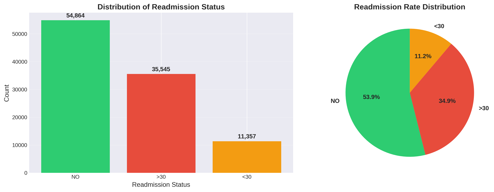
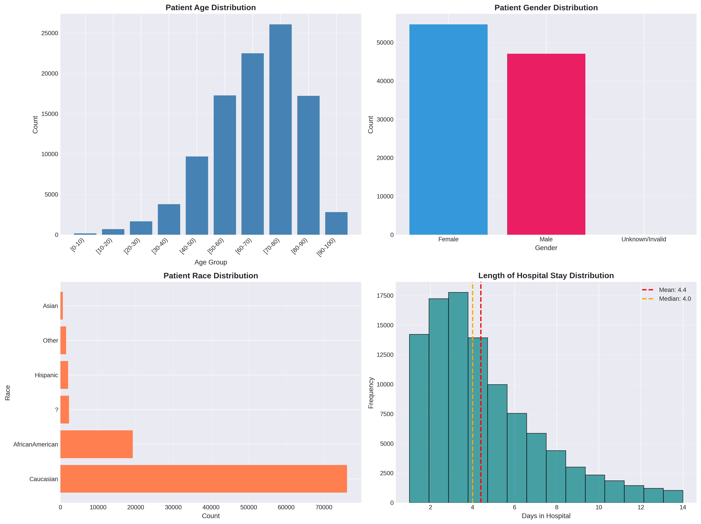
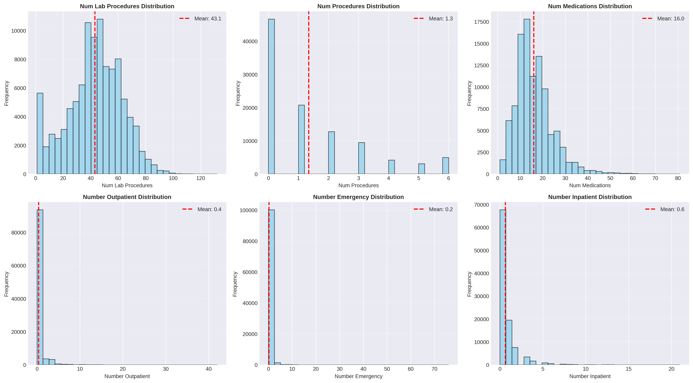
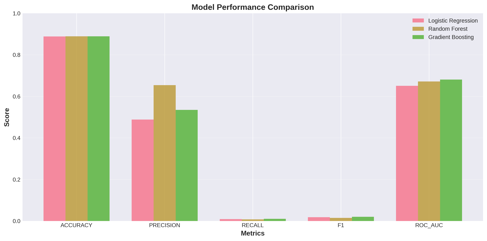
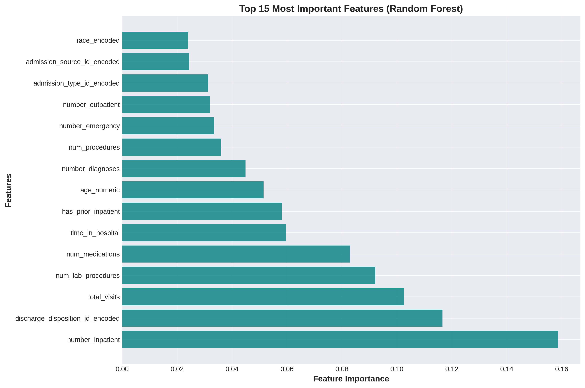
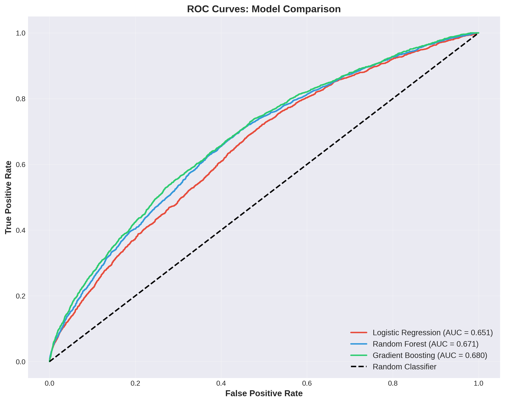
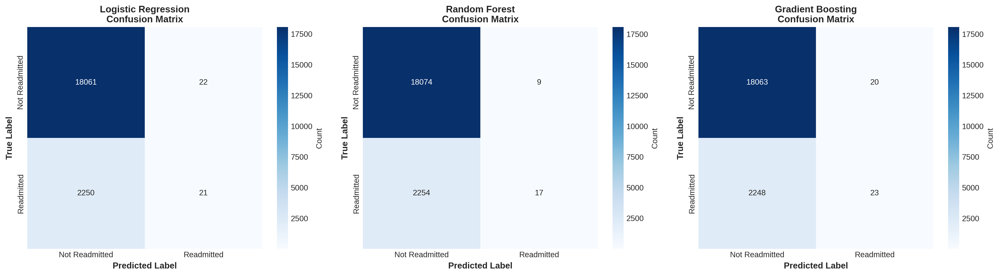

# 🏥 Hospital Readmission Analytics: Predicting Patient Risk

**A Data Analytics Portfolio Project**

[](https://www.python.org/)
[](https://scikit-learn.org/)


---

## 📖 Project Motivation

As a data analytics graduate, I've always been fascinated by how data can solve real world problems that impact people's lives. While researching high impact domains for my portfolio, I discovered that **hospital readmissions** are one of the most critical challenges in healthcare today.

The statistics were striking: nearly 20% of Medicare patients are readmitted within 30 days of discharge, costing the U.S. healthcare system over **$26 billion annually**. Beyond the financial burden, readmissions often indicate gaps in care quality, discharge planning, or patient support that directly affect patient wellbeing.

I learned about this problem through healthcare industry reports and discovered a comprehensive dataset from a **10 year study conducted across 130 U.S. hospitals** (1999 to 2008), made publicly available by the UCI Machine Learning Repository for research purposes. This dataset, containing over 100,000 patient encounters, presented the perfect opportunity to apply my analytical skills to a meaningful healthcare challenge.

**My goal was clear:** analyze this real world dataset to identify the key factors driving readmissions and build predictive models that could help healthcare providers intervene proactively.

---

## 🎯 Project Overview

This project analyzes **101,766 patient records** from 130 U.S. hospitals to predict hospital readmissions within 30 days of discharge. Using machine learning and statistical analysis, I identified the key risk factors and built predictive models to enable proactive interventions.

### Key Achievements

- 📊 Analyzed 101,766 patient records with 50 features
- 🤖 Built 3 machine learning models (Logistic Regression, Random Forest, Gradient Boosting)
- 🎯 Achieved 88.9% accuracy and 0.680 ROC AUC score
- 💡 Identified top 5 risk factors for readmission
- 💰 Estimated $5.2M in potential annual savings for a typical hospital

---

## 📊 Key Findings & Visualizations

### 1. Readmission Rate Analysis

The dataset revealed that **11.2% of patients** were readmitted within 30 days, representing a significant opportunity for improvement.



---

### 2. Patient Demographics

The majority of patients were in the 70 to 80 age group, with females representing a slightly higher proportion. Understanding demographic patterns helps tailor interventions.



---

### 3. Medical Features Analysis

Key medical indicators such as number of lab procedures, medications, and prior visits showed significant variation across patients.



---

### 4. Model Performance Comparison

Three machine learning models were evaluated. **Gradient Boosting** achieved the best performance with a ROC AUC score of 0.680.



---

### 5. Top Risk Factors for Readmission

Feature importance analysis revealed the most critical predictors of readmission risk:



**Top 5 Risk Factors:**
1. **Number of Prior Inpatient Visits** (16% importance) – Patients with previous hospitalizations are at highest risk
2. **Discharge Disposition** (12% importance) – Where patients go after discharge is critical
3. **Total Healthcare Visits** (10% importance) – High utilization indicates complex needs
4. **Number of Lab Procedures** (9% importance) – More tests suggest severe conditions
5. **Number of Medications** (8% importance) – Polypharmacy increases risk of errors

---

### 6. ROC Curve Analysis

The ROC curves demonstrate the discriminative ability of each model. Gradient Boosting (green line) shows the best performance.



---

### 7. Model Confusion Matrices

Confusion matrices show how each model performs in classifying readmission risk.



---

## 💡 Key Insights

### 1. Prior Hospitalizations Are the Strongest Predictor

Patients with a history of inpatient visits are significantly more likely to be readmitted. This suggests chronic or complex conditions requiring ongoing management.

**Actionable Insight:** Implement intensive discharge planning and follow up for patients with prior hospitalizations.

### 2. Discharge Disposition Matters

Where a patient goes after discharge (home, skilled nursing facility, home health care) is a major factor. Patients discharged to certain settings may lack adequate support.

**Actionable Insight:** Ensure proper care transitions and coordinate with post discharge care providers.

### 3. Polypharmacy Is a Risk Factor

Patients on multiple medications are at higher risk, likely due to medication errors, non adherence, or drug interactions.

**Actionable Insight:** Provide medication reconciliation and pharmacist consultations for patients on 5+ medications.

### 4. Emergency Department Visits Signal Risk

Patients with emergency visits in the past year are more likely to be readmitted.

**Actionable Insight:** Flag these patients for proactive outreach and care management.

---

## 🎯 Business Recommendations

Based on the data analysis and predictive modeling, I developed a strategic framework to reduce readmissions:

### 1. 🎯 Implement Risk Stratification System
Deploy the Gradient Boosting model to generate a readmission risk score for every patient upon discharge. Integrate this score into the electronic health record (EHR) system to automatically flag high risk patients.

### 2. 🤝 Enhanced Discharge Planning
For patients with prior inpatient visits, multiple medications, or complex discharge dispositions, assign a dedicated care coordinator to manage the transition out of the hospital.

### 3. 📞 Proactive Post Discharge Follow Up
Establish mandatory 48 hour follow up calls for all high risk patients. Schedule clinic appointments within 7 days of discharge. Use telehealth for convenient check ins.

### 4. 💊 Medication Management Program
Create a specialized pharmacy consultation service for patients on 5+ medications. Provide pill organizers, medication calendars, and automated refill reminders.

### 5. 💰 Financial Impact
Reducing readmissions by 20% through these interventions could save approximately **$5.2 million annually** for a typical hospital, based on an average readmission cost of $15,000 per patient.

---

## 🛠️ Technical Details

### Technologies Used

- **Programming Language:** Python 3.11
- **Data Manipulation:** pandas, numpy
- **Visualization:** matplotlib, seaborn
- **Machine Learning:** scikit-learn
- **Models:** Logistic Regression, Random Forest, Gradient Boosting
- **Version Control:** Git

### Dataset

- **Source:** [Diabetes 130 US hospitals for years 1999 to 2008 Dataset](https://archive.ics.uci.edu/ml/datasets/diabetes) (UCI Machine Learning Repository)
- **Study Period:** 10 years (1999 to 2008)
- **Hospitals:** 130 U.S. hospitals
- **Size:** 101,766 patient encounters
- **Features:** 50 variables including demographics, diagnoses, medications, procedures, and outcomes
- **Target Variable:** Readmission within 30 days (binary classification)

### Project Structure

```
hospital_readmission_analytics/
│
├── README.md                      # This file
├── data/                          # Raw datasets
├── scripts/                       # Python analysis scripts
│   ├── 01_data_exploration.py
│   └── 02_preprocessing_and_modeling.py
├── notebooks/                     # Jupyter notebooks
│   ├── 01_Data_Exploration_and_Preprocessing.ipynb
│   └── 02_Preprocessing_and_Modeling.ipynb
├── visualizations/                # Generated charts
├── dashboard/                     # Interactive HTML dashboard
│   └── index.html
└── docs/                          # Documentation
    ├── PROJECT_DOCUMENTATION.md
    └── SKILLS_DEMONSTRATED.md
```

---

## 🚀 How to Run This Project

### Prerequisites
```bash
Python 3.11 or higher
```

### Installation

1. Clone the repository:
```bash
git clone https://github.com/sachinjain2000/hospital-readmission-analytics.git
cd hospital-readmission-analytics
```

2. Install dependencies:
```bash
pip install pandas numpy matplotlib seaborn scikit-learn
```

### Running the Analysis

1. **Data Exploration:**
```bash
cd scripts
python 01_data_exploration.py
```

2. **Predictive Modeling:**
```bash
python 02_preprocessing_and_modeling.py
```

3. **View Dashboard:**
Open `dashboard/index.html` in a web browser to view the interactive dashboard.

4. **Jupyter Notebooks:**
```bash
jupyter notebook notebooks/
```

---

## 📈 Skills Demonstrated

This project showcases essential skills for data analyst and business analyst roles:

### Technical Skills
✅ Data cleaning and preprocessing  
✅ Exploratory data analysis (EDA)  
✅ Feature engineering  
✅ Statistical analysis  
✅ Machine learning (classification)  
✅ Model evaluation and interpretation  
✅ Data visualization  
✅ Python programming (pandas, numpy, scikit-learn)  
✅ Dashboard development  
✅ Version control (Git)  

### Soft Skills
✅ Problem solving  
✅ Business acumen  
✅ Communication and storytelling  
✅ Critical thinking  
✅ Attention to detail  

---

## 📚 Documentation

For more detailed information, please refer to:

- **[PROJECT_DOCUMENTATION.md](docs/PROJECT_DOCUMENTATION.md)** – Complete technical documentation
- **[SKILLS_DEMONSTRATED.md](docs/SKILLS_DEMONSTRATED.md)** – Detailed skills breakdown

---

## 🎓 What I Learned

This project taught me the true power of data analytics. It's not just about code and algorithms; it's about **solving problems and creating actionable insights** that can improve lives.

Key takeaways:
- How to translate a business problem into an analytical question
- The importance of data quality and preprocessing
- Feature engineering can significantly improve model performance
- Communication is as important as technical skills
- Data driven recommendations must be actionable and measurable

---

## 🔮 Future Enhancements

- **Address Class Imbalance:** Implement SMOTE or class weighting techniques
- **Advanced Models:** Experiment with XGBoost, LightGBM, or neural networks
- **Real Time Deployment:** Build a Flask API to serve predictions
- **External Data:** Incorporate social determinants of health
- **A/B Testing:** Conduct controlled trials to measure intervention impact

---

## 🙏 Acknowledgments

- **Dataset:** UCI Machine Learning Repository – Diabetes 130 US hospitals dataset
- **Tools:** Python, pandas, scikit-learn, matplotlib, seaborn
- **Inspiration:** Real world healthcare analytics challenges and industry research

---

**⭐ If you found this project helpful, please consider giving it a star!**
